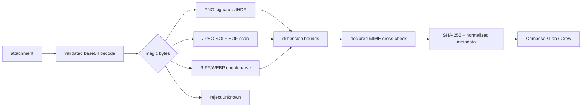
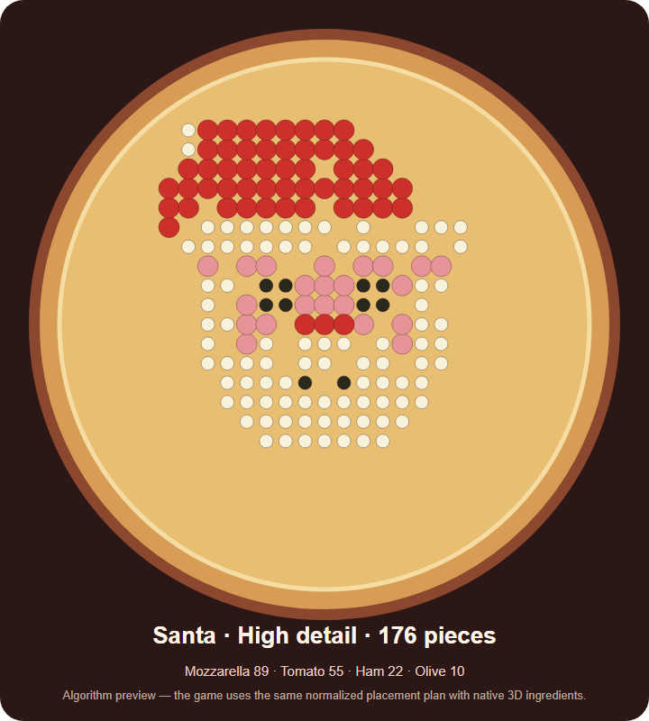
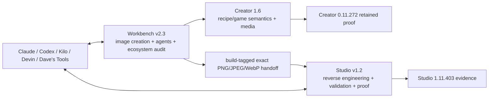

# Pizza Connection 3 / Barro's Pizza — Barro's Pizza Creator 1.6.1 + Mobile 1.0.1

Version **1.6.1** is the in-game AI design layer for the exact standalone Windows x64 **Pizza Connection 3 - Pizza Creator 0.11.272** binary profile. Mobile **1.0.1** adds an installable phone/tablet companion, signed Android package, Hostinger-ready service and an outbound-only Windows pairing bridge. The 1.0.1 Android shell replaces the browser-provider trampoline that could close on Samsung devices with a same-site embedded view, microphone/file-picker delegation and a visible Chrome recovery action.

The ecosystem-facing brand is **Pizza Connection 3 / Barro's Pizza**. The technical Creator target remains the original standalone executable/data/assembly identity because changing those names would invalidate reverse-engineering and proof contracts.

## What Creator adds

The v1.6 final provides a rounded five-tab workspace, guided 6/8/12/18-step pizza sessions, Azure microphone transcription, hands-free Pizza Designer or four-agent conversations, a non-overlapping multi-agent voice roundtable, Symmetry Studio, Ingredient Audition, safe design checkpoints/branches, Contrast Coach, reproducible Pizza DNA, and a large-library Barro's Media Deck. Five owner-supplied songs are packaged as Unity-friendly OGG files and four owner-supplied lyric videos as Unity-safe MP4s; the recursive inbox keeps albums organized while converting common audio to OGG and preserving MP4 video without restarting the game.

It adds one real fifth tab to the existing Bakehouse panel and keeps recipe design inside that space:

- **Chat + Pizza Art Studio** — compact two-row actions, seven picture templates, Draft/Standard/High detail, Precision/Organic placement, Classic/Vegan palettes, deterministic Remix and live recipe cards.
- **AI Lab** — three game-valid alternatives with native Preview and Use actions.
- **Design Crew** — Flavor Chef, Cost Manager, Customer Scout and Creative Director with independent or focused reviews, consensus, optional per-agent Azure voices, a sequential roundtable, voice rate/gap/volume controls, Stop and a master mute.
- **Chef Voice** — Windows device selection, refresh, mute, gain, live input meter, Azure or OpenAI-compatible transcription, Pizza Designer/full-crew routing and optional hands-free continuation after spoken replies.
- **Barro's Media Deck** — nested albums, multiple named playlists, search/filter/sort, bulk organization, current/up-next display, waveform/seek, portrait lyric-video playback, optional synchronized `.lrc` line highlighting for audio songs, shuffle/repeat, volume and three-band tone, recursive audio-to-OGG/MP4 inbox import, and a one-source Stock/Barro's switch that prevents overlapping soundtracks.
- **Ingredient intelligence** — flavor tags, dietary/allergen awareness, curated pairing strengths and cohesion-aware recipe estimates for every exact game ingredient.
- **Inspiration Library** — opt-in use of up to three locally indexed pizza-design images per request from a private library of as many as 500 files.

The UI follows the locked four-mode Barro's references while using the game's parchment/maroon/wood language. It does **not** replace `Assembly-CSharp.dll`, rewrite saves or fake mouse input.

The AI tab replaces the plain Bakehouse heading only while active with the bundled BARRO'S PIZZA CREATOR artwork. The stock title returns on every other tab.

## Unity UI authoring lab

The repository now includes a real Unity **2021.3.45f2** project at `authoring/BarrosCreatorUiLab2021`. It provides a visible, interactive 1920×1080 design lab for new Barro's UI, artwork and animation prototypes without pretending that the compiled Steam game is an editable Unity project.

The lab deliberately exports neutral **PNG + JSON** assets into `assets/ui/generated`. The Unity 2017 runtime loads the five generated rounded skins with file-size/dimension guards and automatically falls back to its built-in rounded textures if any export is absent or invalid. Unity's own documentation warns that newer AssetBundles are not forward-compatible with an older Player, so Unity 2021 AssetBundles are never sent to this 2017.3.1p4 game.

Beginner workflow:

1. Open `authoring/BarrosCreatorUiLab2021` in Unity Hub with Unity 2021.3.45f2.
2. Choose **Barros > 1 - Build or Refresh UI Prototype**.
3. Open `Assets/BarrosLab/Scenes/BarrosCreatorUiLab.unity`, press Play and review the five tabs.
4. Choose **Barros > 2 - Export Unity 2017-Compatible UI Pack**.
5. Reinstall the add-on and press F10 in Pizza Creator.

The dark left rail in the lab is a protected stand-in for the original game's five side tabs. New panels must remain beside it. See `docs/UNITY_UI_AUTHORING_PIPELINE.md` for the complete safe asset matrix and future 3D/animation workflow.

## Exact runtime profile

Creator runtime/build/proof is restricted to:

| Field | Locked Creator profile |
|---|---|
| Build profile | `creator-0.11.272` |
| Product | `0.11.272` |
| Steam app | `851330` |
| Unity | `2017.3.1p4` x64 |
| Data folder | `Pizza Connection 3 - Pizza Creator_Data` |
| `Assembly-CSharp.dll` SHA-256 | `ebf8698df7cb4af904c98c299994705ea529efbdf1e8ccb3e7ca8cb42a1cbc1c` |
| `Assembly-CSharp-firstpass.dll` SHA-256 | `f9cbf0951fc4d4b0788c47bbe41a3820fa333d293175bbb7cb398eb4728fd284` |

Runtime Proof Studio's primary `studio-1.11.403 / Unity 2017.4.40f1` build is a **different binary profile**. Shared Barro's images and workflow concepts can cross profiles, but Creator assemblies, scenes, PathIDs and runtime proof cannot be reused there without a separate port/re-verification.

See `contracts/pc3-build-compatibility.json`.

## Windows install

The v1.6.1 Windows release is available in two forms:

- **Setup EXE** — double-click `Barros_Pizza_Creator_v1.6.1_Setup.exe` for a normal Windows install with Start-menu shortcuts, optional desktop shortcut, repair support and an Add/Remove Programs uninstaller.
- **Portable ZIP** — extract `Barros_Pizza_Creator_v1.6.1_Portable.zip`, then double-click `Barros_Pizza_Creator_Manager.exe` or `INSTALL_OFFLINE.cmd`. Nothing runs correctly from inside the ZIP.

Both packages are complete offline add-on toolkits. They include the verified BepInEx 5.4.23.5 x64 loader and a private Python 3.12.10 runtime, but **do not include the commercial Pizza Creator game**. The setup detects the existing Steam/default install or lets the user browse to it, verifies the exact Creator 0.11.272 assembly hashes, and refuses unsupported builds.

1. Close Pizza Creator.
2. Run the Setup EXE, or extract and open the portable manager.
3. Select the folder containing `Pizza Connection 3 - Pizza Creator.exe`.
4. Choose **Verify Game**, then **Install / Repair** when using the portable manager.
5. Launch Pizza Creator, enter Bakehouse and select the new chef-chat tab. **F10** reopens it.

Repair preserves provider settings and owner-added media. Uninstall removes the Barro's add-on while preserving the original game and shared BepInEx files. Community binaries are currently unsigned, so Windows SmartScreen can show **Unknown publisher**; verify the published SHA-256 file before running them. See `docs/WINDOWS_V1_6_RELEASE.md`.

Evidence shortcuts:

- **F8** — capture active Chat/Lab/Crew/Voice view;
- **F9** — verify loaded pizza against the last recipe-book save;
- **F10** — reopen the AI tab.

Run `CONFIGURE_AI_PROVIDER.bat` for model/voice provider setup. Offline recipe design works without a provider.

## Android, mobile web and Hostinger VPS

Mobile 1.0.1 is a companion to the Windows game, not a redistribution or Android conversion of the commercial Unity executable. It works without root on the Samsung Tab S9+ and S21 Ultra and provides phone/tablet layouts, installable PWA behavior, AI design and Crew requests, microphone transcription, Azure voice playback, secure six-digit Windows pairing and one-tap recipe delivery.

Release files:

- `Barros_Pizza_Creator_Mobile_v1.0.1.apk` — signed personal Android installer for the two Samsung devices;
- `Barros_Pizza_Creator_Mobile_v1.0.1.aab` — Play/managed-distribution bundle using the same signing identity;
- `Barros_Creator_Hostinger_Server_v1.0.1.zip` — web, protected API, Docker Compose, Caddy HTTPS and persistent-volume package for `creator.daveai.tech`;
- `Barros_Creator_Windows_Bridge_v1.0.1.zip` — outbound-only pairing bridge for the Windows Creator.

The hosted API refuses a non-local listener without `BARROS_API_TOKEN`, limits requests, restricts browser origins and keeps provider keys in the VPS environment. The Windows bridge polls outward, so no game or home-router port is exposed. A remote design enters the existing game-valid recipe pipeline and appears in the Barro's tab for human Preview, Apply and Save approval.

See `docs/MOBILE_VPS_RELEASE.md` for installation, Hostinger deployment, DNS, pairing, Android signing and verification details.

## Visual attachments and JPEG parsing

Creator 1.6 validates image bytes before provider orchestration. It does not trust a `.jpg`, `.png` or `.webp` extension by itself.



Current visual limits:

- 4 MiB decoded per visual attachment;
- 8 total attachments;
- 12 MiB aggregate decoded visual bytes;
- maximum parsed dimension 32768×32768;
- PNG, JPEG and WebP binary visuals;
- MIME spoofing rejected when declared type conflicts with decoded bytes.

`POST /inspect-attachment` returns normalized metadata and SHA-256 without echoing raw image bytes. Workbench exposes the same parser through its `pizza_creator_inspect_attachment` tool.

Text attachments (JSON/TXT/Markdown and related bounded text input) stay separate from binary visual parsing.

## Local Inspiration Library

Run `IMPORT_Barros_Inspiration.ps1` and choose a folder containing pizza-design JPG, PNG or WebP files. The Windows helper finds the installed Steam Barro's backend when available, validates real image bytes, rejects malformed or spoofed files, deduplicates by SHA-256 and indexes at most 500 images. The in-game **Ideas OFF/ON** button controls whether up to three relevant local designs accompany the next AI request.

The library lives under `backend/data/inspiration`, is ignored by Git and is explicitly excluded from release ZIPs. Images remain local reference material; every import records `user-owned`, `permission-granted` or `reference-only` rights. Only import images you are allowed to retain and use. A Facebook archive or album download can be imported after it is obtained through an authorized account or export flow.

## Using Chat

Choose Build with me, Pizza art, Surprise me or Improve this. Describe the pizza and optionally attach a validated visual or bounded text note. A vision-capable provider receives image attachments only after parser validation. The final recipe is repaired against the real game catalog before Unity receives it.

## Pizza Art Studio

Pizza Art turns a picture concept into exact native ingredient placements instead of asking the stock random distributor to approximate a picture. The included templates are Santa, Face, Heart, Christmas Tree, Smiley, Snowman and Star. High detail uses 176 pieces, leaving four places below the hard 180-placement safety limit. Standard and Draft deliberately use fewer real pieces.

Every exact game ingredient has compact visual metadata: approximate color, geometry, footprint and useful orientation. The compiler maps artwork roles to installed ingredients, protects small facial/outline accents during downsampling, clips coordinates to the selected dough shape, orders semantic layers and then lets the real game render the resulting 3D toppings. The same seed reproduces the same plan; Remix changes it deterministically.

An online vision model can return a bounded color-role `pixel_map` for a custom picture. The local compiler still validates and converts the map; the model never sends arbitrary game object names or coordinates directly to Unity.



## AI Lab

Set heat/shape, describe the goal and choose **Generate 3**. Each candidate carries Taste, Cost, Profit, Popularity, Novelty and Originality. Preview uses the actual Pizza Creator model path; Start over restores the pre-preview pizza.

## Design Crew

The four personas review a validated draft. **Ask** runs one focused persona review; **Ask all four agents** runs the full crew. One model/persona failure cannot cancel the other opinions. Offline mode uses deterministic specialist logic.

Optional Azure agent speech uses a distinct voice per persona: Maisie (en-GB), Darren (en-AU), Ryan (en-GB) and Carly (en-AU). Speech starts muted, exposes Speak/Stop and master mute controls, and filters links, code blocks and file paths before synthesis. Configure it through `CONFIGURE_AI_PROVIDER.bat`; credentials stay in the named environment or `.env` reference. Health reports configuration separately from reachability and does not claim speech works until a real request succeeds.

## Chef Voice

Start Listening, speak for up to 30 seconds, stop and transcribe. STT requires a configured compatible endpoint; keyboard/attachments/offline design remain available without STT.

## Applying, previewing and saving

Preview/Apply invoke the real `IPizzaCreatorService.LoadPizzaFromModel` path. Ingredients are instantiated through the game's renderer. Save to recipe book invokes the existing Creator recipe-book method.

The backend does not write proprietary saves directly.

## Scores

| Score | Source |
|---|---|
| Taste | average of real `CitizenTypeController.RatePizzaRecipe` results |
| Popularity | average of real `RatePizzaOverallTaste` results |
| Cost | `PizzaModel.CalculateCosts()` from actual placed ingredient sizes |
| Profit | actual PizzaModel cost/price/profit factor |
| Novelty | deterministic catalog craziness + ingredient-count heuristic |
| Originality | deterministic layout-distribution + catalog craziness heuristic |

Backend estimates are replaced by native values once a candidate is bound in Unity.

## Creator sidecar API

Default: `http://127.0.0.1:48173`.

| Method | Endpoint | Purpose |
|---|---|---|
| GET | `/health` | version/provider/parser status |
| GET | `/history` | retained design history |
| GET | `/proof/latest` | retained proof/certification envelope consumed by Workbench and Studio; absence stays `not_run`/unavailable rather than fabricated PASS |
| POST | `/inspect-attachment` | validate visual bytes and return metadata |
| POST | `/compose` / `/chat` | design one pizza |
| POST | `/lab` | three alternatives |
| POST | `/crew` | design-crew review |
| POST | `/transcribe` | STT |
| POST | `/speak` | optional Azure design-agent speech |
| POST | `/reload` | reload provider settings |
| POST | `/shutdown` | controlled sidecar shutdown |

## Providers

| Provider | Typical endpoint | Notes |
|---|---|---|
| Offline | none | deterministic built-in designer |
| LM Studio / OpenAI-compatible | `http://127.0.0.1:1234/v1` | local/hosted chat/vision |
| Ollama | `http://127.0.0.1:11434` | local models; vision only when model supports it |
| OpenAI-compatible hosted | provider base | key resolved from configured environment |
| Anthropic | configured Messages API base | key resolved from configured environment |

Keys are read at runtime from configured environment/file references; release ZIP/logs do not intentionally contain keys.

## Workbench and Runtime Proof Studio

Creator is one part of the larger Pizza Connection 3 / Barro's Pizza workflow:



Workbench/Studio do not duplicate Creator's recipe solver or binary attachment parser. Creator does not duplicate Studio's PathID/extraction/runtime-proof system.

The shared release line is tracked by:

- `contracts/ecosystem.acceptance.json` — base three-project gates;
- `contracts/ecosystem.image.acceptance.json` — PNG/JPEG/image-handoff gates;
- `contracts/ecosystem.release.acceptance.json` — Creator 1.1 / Workbench 2.3 / Studio 1.2 release overlay.

Both Workbench v2.3 and Studio v1.2 expose the same conceptual **ecosystem audit**. It reports readiness/attention and never substitutes for retained Creator All-stage runtime certification.

## Diagnostics, truth and removal

- **`RUN_RC1_PROOF.bat`** — layered evidence-first proof ledger; unrun gates are never reported as passed.
- **`DIAGNOSE_Barros_AI.bat`** — shorter install/loader/backend diagnostics.
- Creator BepInEx log: `S:\Unity_Games\PC3 - Pizza Creator\BepInEx\LogOutput.log` on the default install.
- Backend history: `...\BarrosAI\backend\data\conversation_history.json`.
- **`UNINSTALL_Barros_AI_Designer.bat`** removes this plugin/sidecar while leaving game assemblies and saves alone.

## Tests and deterministic packaging

Public CI runs:

- full backend/attachment/contract unittest suite;
- locked JSON validation;
- Windows static proof harness;
- deterministic release ZIP build twice;
- byte-for-byte comparison of both ZIP outputs;
- release ZIP manifest/hash/CRC verification.

Proprietary assemblies and live Unity runtime are intentionally absent from public CI, so live Windows/game gates remain separate.

Maintainers can run:

```text
python tools/build_release.py
```

or verify an existing archive with `--verify-only`.

The Windows Setup EXE and complete portable ZIP are built and lifecycle-tested with:

```text
.\tools\build_windows_release.ps1
.\tools\test_windows_installer.ps1 -GameRoot "C:\path\to\Pizza Connection 3 - Pizza Creator"
```

## Crash / monsoon recovery

Durable state:

1. Git commit SHAs;
2. `docs/ECOSYSTEM_RECOVERY_CHECKPOINT_2026-08-25.md` — current three-project recovery map;
3. `contracts/rc1.acceptance.json` for Creator 0.11.272;
4. `contracts/ecosystem.acceptance.json` for all three projects;
5. `contracts/ecosystem.image.acceptance.json` for image/JPEG/PNG handoff;
6. `contracts/ecosystem.release.acceptance.json` for the current release line;
7. `contracts/pc3-build-compatibility.json` for build routing;
8. `contracts/pc3-image-handoff.schema.json` for shared image handoff;
9. Creator timestamped evidence runs;
10. Workbench image ledger + Studio evidence for asset work.

After interruption, read the recovery checkpoint, run static/tests/doctor first, verify the intended build profile, then continue only gates that lack retained PASS evidence.

## Current proof boundary

The v1.6 exact-assembly artifact passed its original **115/115 tests**; the full source with Windows packaging and final-header gates now passes **121/121**. The final Windows run loaded the generated Unity-lab skin pack inside the exact Unity 2017.3.1p4 game, retained all five tabs, fitted the panel from x=1346 to x=1920 with a six-pixel gap beside the original rail, and rendered the compact Media layout without cutoff. The complete Barro's header is centered in the close-button-safe title area, enlarged slightly for 1080p legibility and retains both decorative end caps. The plug-in SHA-256 is `c052adc8ee12a5c3a5e1c36d67b0366d22e917ce744c1664c43684b42e7d54bb`. See `docs/V1_6_RUNTIME_PROOF_2026-08-27.md`, `docs/WINDOWS_V1_6_RELEASE.md` and the three v1.6 proof images under `docs/images/`.

Four owner lyric videos passed complete FFmpeg decode and the live high-profile MP4 passed prepare, portrait fit, play, pause, resume, seek and Lyrics On/Off. Direct MiniMax Chat/Crew and an Azure synthetic TTS→STT roundtrip passed. Windows found the Turtle Beach P11 microphone and opened capture, but a real spoken phrase was not recognized during the retained test; physical speech is therefore not called a pass. Audio-only `.lrc` highlighting is implemented, but no OCR-generated LRC is packaged because the draft contained transcription errors. Native Save/reload remains deliberately unrun, the Inspiration Library is empty, and unrelated PC2/PC3 repositories were not changed.

## Documentation

- `docs/ECOSYSTEM_RECOVERY_CHECKPOINT_2026-08-25.md`
- `docs/PIZZA_CONNECTION_3_BARROS_PIZZA_ECOSYSTEM.md`
- `docs/ECOSYSTEM_V2_ARCHITECTURE.md`
- `docs/ENGINEERING_PLAYBOOK.md`
- `docs/UNITY_UI_AUTHORING_PIPELINE.md`
- `docs/V1_6_RUNTIME_PROOF_2026-08-27.md`
- `docs/PROJECT_STATUS.md`
- `docs/V1_5_RUNTIME_PROOF_2026-08-27.md`
- `docs/V1_4_RUNTIME_PROOF_2026-08-27.md`
- `docs/V1_3_RUNTIME_PROOF_2026-08-27.md`
- `docs/PROOF_CONTRACT.md`
- `docs/UPSTREAM_AUDIT.md`
- `docs/ARCHITECTURE.md`
- `docs/REVERSE_ENGINEERING_EVIDENCE.md`
- `docs/UI_MOCKUP_MAPPING.md`
- `docs/RUNTIME_ACCEPTANCE.md`
- `docs/AUDIO_PIPELINE.md`
- `CLAUDE_HANDOFF.md`
