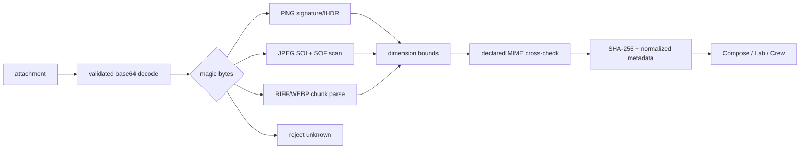
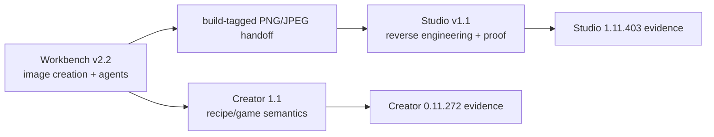

# Pizza Connection 3 / Barro's Pizza — Barro's Pizza Creator 1.1 RC

Version **1.1.0-rc1** is the in-game AI design layer for the exact standalone Windows x64 **Pizza Connection 3 - Pizza Creator 0.11.272** binary profile.

The ecosystem-facing brand is **Pizza Connection 3 / Barro's Pizza**. The technical Creator target remains the original standalone executable/data/assembly identity because changing those names would invalidate reverse-engineering and proof contracts.

## What Creator adds

It adds one real fifth tab to the existing Bakehouse panel and keeps recipe design inside that space:

- **Chat** — Build with me, Surprise me, Improve this, conversation history, validated attachments and live recipe cards.
- **AI Lab** — three game-valid alternatives with native Preview and Use actions.
- **Design Crew** — Flavor Chef, Cost Manager, Customer Scout and Creative Director with independent opinions and consensus.
- **Chef Voice** — Windows microphone capture and OpenAI-compatible/Whisper transcription.

The UI follows the locked four-mode Barro's references while using the game's parchment/maroon/wood language. It does **not** replace `Assembly-CSharp.dll`, rewrite saves or fake mouse input.

The AI tab replaces the plain Bakehouse heading only while active with the bundled BARRO'S PIZZA CREATOR artwork. The stock title returns on every other tab.

## Exact runtime profile

Creator runtime/build/proof is restricted to:

| Field | Locked Creator profile |
|---|---|
| Build profile | `creator-0.11.272` |
| Product | `0.11.272` |
| Steam app | `851330` |
| Unity | `2017.3.1p4` x64 |
| Data folder | `Pizza Connection 3 - Pizza Creator_Data` |
| `Assembly-CSharp.dll` SHA-256 | `ebf8698df7cb4af904c98c299994705ea529efbdf1e8ccb3e7ca8cb42a1cbc1c` |
| `Assembly-CSharp-firstpass.dll` SHA-256 | `f9cbf0951fc4d4b0788c47bbe41a3820fa333d293175bbb7cb398eb4728fd284` |

Runtime Proof Studio's primary `studio-1.11.403 / Unity 2017.4.40f1` build is a **different binary profile**. Shared Barro's images and workflow concepts can cross profiles, but Creator assemblies, scenes, PathIDs and runtime proof cannot be reused there without a separate port/re-verification.

See `contracts/pc3-build-compatibility.json`.

## Install

1. Close Pizza Creator.
2. Extract the release ZIP outside the game folder.
3. Double-click **`INSTALL_Barros_AI_Designer.bat`**.
4. The installer defaults to `S:\Unity_Games\PC3 - Pizza Creator`; browse only to the matching Creator 0.11.272 install.
5. Launch Pizza Connection 3 - Pizza Creator normally and enter Bakehouse.
6. Select the new chef-chat tab. **F10** reopens it when needed.

The installer SHA-256 verifies pinned BepInEx 5.4.23.5 x64 and the embedded Python runtime. It refuses mismatching game assembly hashes instead of installing against an unverified ABI.

Evidence shortcuts:

- **F8** — capture active Chat/Lab/Crew/Voice view;
- **F9** — verify loaded pizza against the last recipe-book save;
- **F10** — reopen the AI tab.

Run `CONFIGURE_AI_PROVIDER.bat` for model/voice provider setup. Offline recipe design works without a provider.

## Visual attachments and JPEG parsing

Creator 1.1 validates image bytes before provider orchestration. It does not trust a `.jpg`, `.png` or `.webp` extension by itself.



Current visual limits:

- 4 MiB decoded per visual attachment;
- 8 total attachments;
- 12 MiB aggregate decoded visual bytes;
- maximum parsed dimension 32768×32768;
- PNG, JPEG and WebP binary visuals;
- MIME spoofing rejected when declared type conflicts with decoded bytes.

`POST /inspect-attachment` returns normalized metadata and SHA-256 without echoing raw image bytes. Workbench exposes the same parser through its `pizza_creator_inspect_attachment` tool.

Text attachments (JSON/TXT/Markdown and related bounded text input) stay separate from binary visual parsing.

## Using Chat

Choose Build with me, Surprise me or Improve this. Describe the pizza and optionally attach a validated visual or bounded text note. A vision-capable provider receives image attachments only after parser validation. The final recipe is repaired against the real game catalog before Unity receives it.

## AI Lab

Set heat/shape, describe the goal and choose **Generate 3**. Each candidate carries Taste, Cost, Profit, Popularity, Novelty and Originality. Preview uses the actual Pizza Creator model path; Start over restores the pre-preview pizza.

## Design Crew

The four personas review a validated draft. One model/persona failure cannot cancel the other opinions. Offline mode uses deterministic specialist logic.

## Chef Voice

Start Listening, speak for up to 30 seconds, stop and transcribe. STT requires a configured compatible endpoint; keyboard/attachments/offline design remain available without STT.

## Applying, previewing and saving

Preview/Apply invoke the real `IPizzaCreatorService.LoadPizzaFromModel` path. Ingredients are instantiated through the game's renderer. Save to recipe book invokes the existing Creator recipe-book method.

The backend does not write proprietary saves directly.

## Scores

| Score | Source |
|---|---|
| Taste | average of real `CitizenTypeController.RatePizzaRecipe` results |
| Popularity | average of real `RatePizzaOverallTaste` results |
| Cost | `PizzaModel.CalculateCosts()` from actual placed ingredient sizes |
| Profit | actual PizzaModel cost/price/profit factor |
| Novelty | deterministic catalog craziness + ingredient-count heuristic |
| Originality | deterministic layout-distribution + catalog craziness heuristic |

Backend estimates are replaced by native values once a candidate is bound in Unity.

## Creator sidecar API

Default: `http://127.0.0.1:48173`.

| Method | Endpoint | Purpose |
|---|---|---|
| GET | `/health` | version/provider/parser status |
| GET | `/history` | retained design history |
| POST | `/inspect-attachment` | validate visual bytes and return metadata |
| POST | `/compose` / `/chat` | design one pizza |
| POST | `/lab` | three alternatives |
| POST | `/crew` | design-crew review |
| POST | `/transcribe` | STT |
| POST | `/reload` | reload provider settings |
| POST | `/shutdown` | controlled sidecar shutdown |

## Providers

| Provider | Typical endpoint | Notes |
|---|---|---|
| Offline | none | deterministic built-in designer |
| LM Studio / OpenAI-compatible | `http://127.0.0.1:1234/v1` | local/hosted chat/vision |
| Ollama | `http://127.0.0.1:11434` | local models; vision only when model supports it |
| OpenAI-compatible hosted | provider base | key resolved from configured environment |
| Anthropic | configured Messages API base | key resolved from configured environment |

Keys are read at runtime from configured environment/file references; release ZIP/logs do not intentionally contain keys.

## Workbench and Runtime Proof Studio

Creator is one part of the larger Pizza Connection 3 / Barro's Pizza workflow:



Workbench/Studio do not duplicate Creator's recipe solver or binary attachment parser. Creator does not duplicate Studio's PathID/extraction/runtime-proof system.

## Diagnostics, truth and removal

- **`RUN_RC1_PROOF.bat`** — layered evidence-first proof ledger; unrun gates are never reported as passed.
- **`DIAGNOSE_Barros_AI.bat`** — shorter install/loader/backend diagnostics.
- Creator BepInEx log: `S:\Unity_Games\PC3 - Pizza Creator\BepInEx\LogOutput.log` on the default install.
- Backend history: `...\BarrosAI\backend\data\conversation_history.json`.
- **`UNINSTALL_Barros_AI_Designer.bat`** removes this plugin/sidecar while leaving game assemblies and saves alone.

## Tests and deterministic packaging

Public CI runs:

- full backend/attachment/contract unittest suite;
- locked JSON validation;
- Windows static proof harness;
- deterministic release ZIP build twice;
- byte-for-byte comparison of both ZIP outputs;
- release ZIP manifest/hash/CRC verification.

Proprietary assemblies and live Unity runtime are intentionally absent from public CI, so live Windows/game gates remain separate.

Maintainers can run:

```text
python tools/build_release.py
```

or verify an existing archive with `--verify-only`.

## Crash / monsoon recovery

Durable state:

1. Git commit SHAs;
2. `contracts/rc1.acceptance.json` for Creator 0.11.272;
3. `contracts/ecosystem.acceptance.json` for all three projects;
4. `contracts/pc3-build-compatibility.json` for build routing;
5. `contracts/pc3-image-handoff.schema.json` for shared image handoff;
6. Creator timestamped evidence runs;
7. Workbench image ledger + Studio evidence for asset work.

After interruption, run the static/tests/doctor path first, verify the intended build profile, and continue only gates that lack retained PASS evidence.

## Documentation

- `docs/ECOSYSTEM_V2_ARCHITECTURE.md`
- `docs/ENGINEERING_PLAYBOOK.md`
- `docs/PROJECT_STATUS.md`
- `docs/PROOF_CONTRACT.md`
- `docs/UPSTREAM_AUDIT.md`
- `docs/ARCHITECTURE.md`
- `docs/REVERSE_ENGINEERING_EVIDENCE.md`
- `docs/UI_MOCKUP_MAPPING.md`
- `docs/RUNTIME_ACCEPTANCE.md`
- `docs/AUDIO_PIPELINE.md`
- `CLAUDE_HANDOFF.md`
