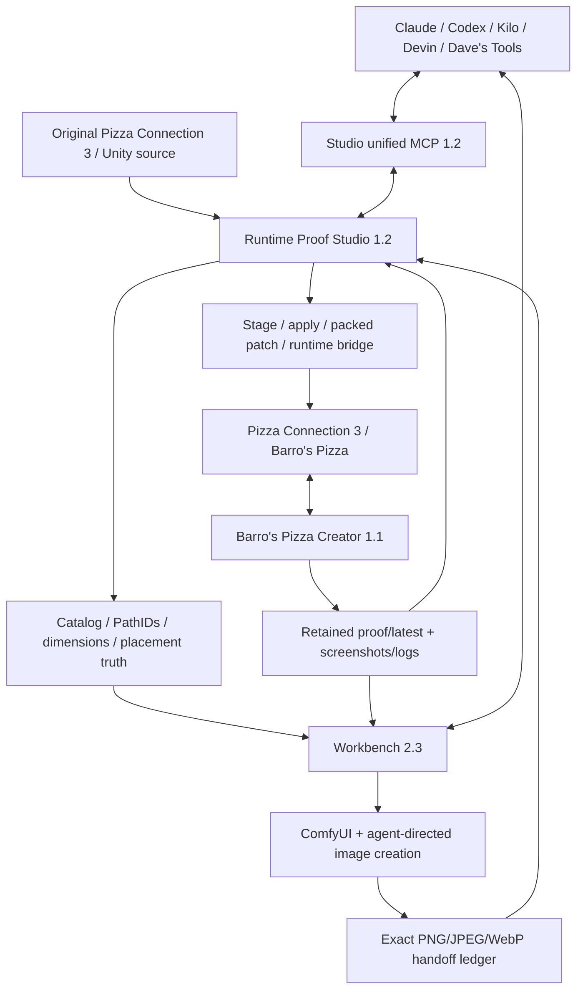

# Pizza Connection 3 / Barro's Pizza — Ecosystem Recovery Checkpoint

**Date:** 2026-08-25

This is the canonical repository-local recovery map for the Creator + Workbench + Runtime Proof Studio ecosystem. It exists so progress can resume after a crash, power outage, interrupted agent session, or lost chat history without guessing what was proven.

## Current release line

| Project | Version | Role |
|---|---|---|
| Barro's Pizza Creator | `1.1.0-rc1` | In-game pizza recipe authority, fifth tab, provider routing, voice, preview/apply/save, retained proof |
| Barro's Workbench | `2.3.0-rc1` | AI/ComfyUI creation, Creator chat/voice/tools, exact image contracts, handoff, ecosystem audit |
| Runtime Proof Studio | `1.2.0-rc1` | Unity extraction/reverse engineering, target validation, staging/runtime proof, evidence, unified MCP |

## System diagram

## Canonical truth contracts

- `contracts/rc1.acceptance.json` — Creator release proof.
- `contracts/ecosystem.acceptance.json` — base three-project acceptance.
- `contracts/ecosystem.image.acceptance.json` — image/JPEG/PNG handoff acceptance.
- `contracts/ecosystem.release.acceptance.json` — v2 unified release overlay.

A gate is not PASS because code exists, a mockup looks correct, a CI test is green, or a readiness audit is green. Runtime/visual gates require the retained evidence named by the contract.

## Runtime profiles must stay separate

- Creator: `creator-0.11.272`
- Studio extraction/runtime: `studio-1.11.403`

Do not merge their Assembly-CSharp hashes, Unity version assumptions, scene facts or PathIDs. The tooling routes Creator proof to the Creator root and Studio extraction/runtime actions to the Studio/PC3 root.

## Image handoff truth

The authoritative Workbench handoff schema is `schema_version=1.0` with top-level `items`, each item kind `barros-pc3-image-handoff`. Studio's authoritative parser/validator is `scripts/pc3_pizza_creator_bridge.py`.

Every game candidate should remain traceable through:

`stock source -> exact contract -> generation/iteration -> finalized bytes -> Studio validation -> staging -> runtime screenshot -> restore or commit`

PNG/JPEG/WebP are validated by actual bytes/metadata, not extension alone. Transparency is preserved where required. A good-looking preview is not proof that a replacement is game-safe.

## Proven automated checkpoints

### Workbench v2.3 implementation commit

`85a3064d80aa426f62ef4d004efb63a84803a117`

- integration proof `32834355232`: PASS
- visual preflight `32834355306`: PASS
- operator recovery `32834355357`: PASS
- deterministic release package `32834355440`: PASS

### Studio v1.2

A real packaging/import bug was found by CI and fixed rather than ignored. Initial MCP v1.2 run `32834626642` failed during pytest collection. Commit `ecc54eab65c877bd1975bbaca465d9caa04d8a66` corrected dual script/package imports.

- corrected MCP v1.2 run `32834913792`: PASS
- full Windows integrated Studio run `32834989088`: PASS, including compile, portable Creator integration, complete unittest gate and repository-wide pytest.

These proofs establish source/test/package behavior. They do **not** certify the live PC3 game or substitute for the required Windows screenshots.

## Known live-proof remainder

The ecosystem is not yet truthfully 100% complete. Remaining release-required work includes:

1. Creator live BepInEx/fifth-tab proof in the actual game;
2. live 3D preview/restore/apply and save/reload proof;
3. live microphone/STT proof;
4. four live in-game Creator mode screenshots: Chat, AI Lab, Design Crew, Chef Voice;
5. live Workbench 2.3 screenshot and real `Audit Ecosystem` retained JSON;
6. live Studio 1.2 screenshot and real `Audit Ecosystem` retained JSON;
7. at least one real image chain through Workbench generation -> Studio validation -> runtime apply screenshot -> restore/commit;
8. GitLab remote SHA parity verification.

## Git publication truth

GitHub writes are available and all changes in this checkpoint were committed directly to `main` in the three connected repositories. This ChatGPT session has **no GitLab connector/plugin**, so GitLab publication/parity must remain unverified rather than being claimed complete.

## Resume order after interruption

1. Read this checkpoint and `contracts/ecosystem.release.acceptance.json`.
2. Read Workbench `docs/V2_3_RECOVERY_CHECKPOINT.md`.
3. Read Studio `docs/V1_2_RECOVERY_CHECKPOINT.md`.
4. Verify current GitHub Actions on the latest `main` SHAs.
5. On the Windows PC, launch Workbench v2.3 and Studio v1.2 and run their shared ecosystem audit.
6. Resolve any `attention`, `blocked`, `fail`, or `not_run` item without converting it to PASS until its named evidence exists.
7. Execute the Creator live proof harness and retain all required screenshots/logs/results.
8. Verify GitLab mirrors separately when an authenticated GitLab route is available.
