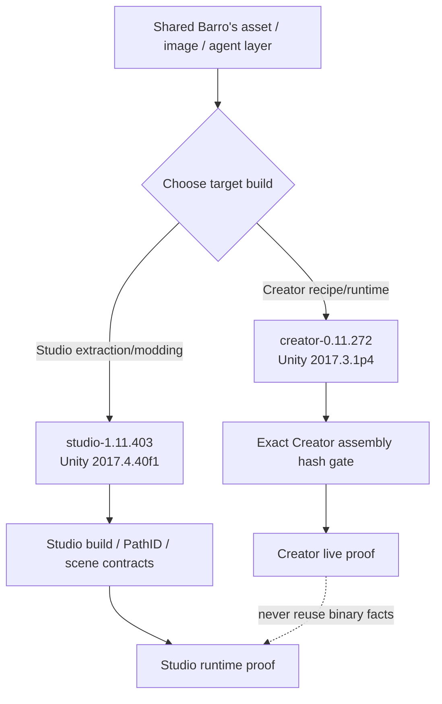
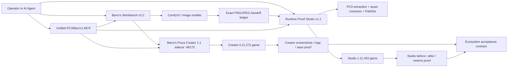
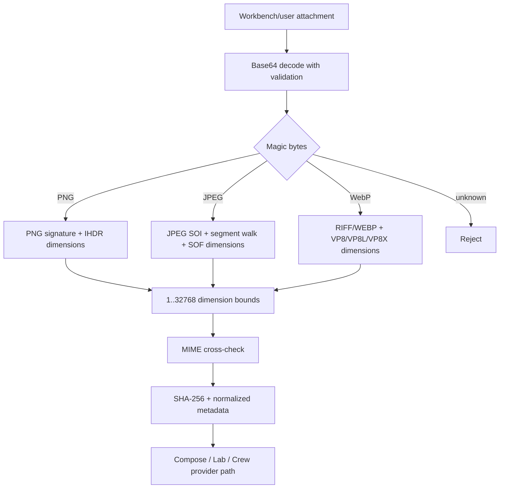
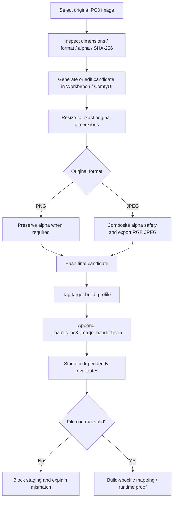
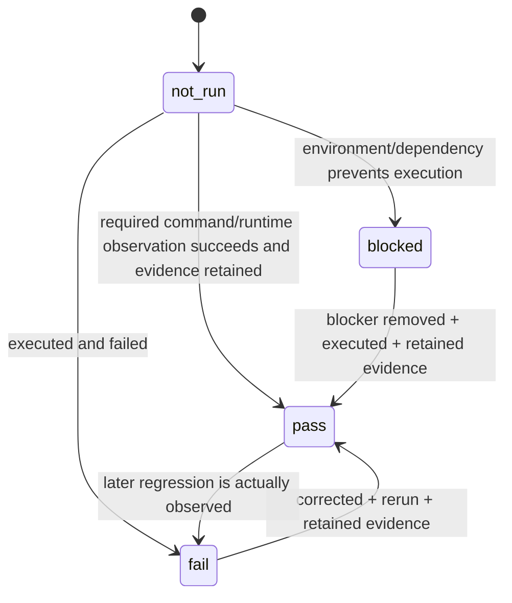

# Pizza Connection 3 / Barro's Pizza — Ecosystem v2.2 Architecture

This is the recovery-oriented integration map for Barro's Pizza Creator, Barro's Workbench, and PC3 Barro's Runtime Proof Studio.

## Naming and compatibility rule

**User-facing game/project name:** `Pizza Connection 3 / Barro's Pizza`.

Branding is shared. Binary identity is not. Keep every build-native executable/Data-folder name, `Assembly-CSharp.dll`, scene/object ID, PathID, serialized field name, hash and stock path unchanged unless a build-specific reverse-engineering pass proves a migration.

## Critical dual-build routing

The ecosystem currently has two separately verified PC3 runtime profiles:

| Profile | Role | Product | Unity | Runtime rule |
|---|---|---:|---|---|
| `creator-0.11.272` | Pizza Creator RC1 | `0.11.272` | `2017.3.1p4` | Creator plugin/proof only against exact locked assembly hashes |
| `studio-1.11.403` | Studio extraction/conversion | `1.11.403 Final` | `2017.4.40f1` | Studio extraction, PathID, staging and runtime evidence profile |

Creator `Assembly-CSharp.dll` SHA-256: `ebf8698df7cb4af904c98c299994705ea529efbdf1e8ccb3e7ca8cb42a1cbc1c`.

Creator `Assembly-CSharp-firstpass.dll` SHA-256: `f9cbf0951fc4d4b0788c47bbe41a3820fa333d293175bbb7cb398eb4728fd284`.

Shared PNG/JPEG generation logic does **not** make assemblies, PathIDs, scene maps, runtime bridges or screenshots interchangeable. `contracts/pc3-build-compatibility.json` is authoritative.

## One ecosystem, three responsibilities

### Barro's Pizza Creator 1.1

Authoritative for the Creator recipe/game bridge on `creator-0.11.272`:

- injected fifth Pizza Creator tab through BepInEx;
- real 87-item ingredient catalog supplied by the running game;
- native `PizzaModel` preview/apply/restore/save path;
- game-native scores after preview;
- Chat, AI Lab, Design Crew and Chef Voice;
- local sidecar on `127.0.0.1:48173`;
- provider routing and deterministic offline fallback;
- retained runtime evidence and F8 screenshots;
- validated visual attachments for AI requests.

It does **not** become a general PC3 image editor. Workbench and Studio own asset authoring and runtime mapping.

### Barro's Workbench v2.2

Authoritative for fast creation/orchestration:

- dual source/output visual file panels;
- ComfyUI img2img and batch generation;
- local/hosted LLM chat and MCP tools;
- Creator status/design/attachment-inspection tools;
- exact PNG/JPEG source-contract inspection;
- exact dimension/format/alpha export;
- build-profile-tagged SHA-256 handoff ledger;
- bidirectional launch into Runtime Proof Studio;
- separate Studio and Creator game roots.

### Runtime Proof Studio v1.1

Authoritative for reverse engineering, mapping, staging and proof:

- PC3 install/build discovery;
- source extraction and Unity object/texture metadata;
- asset-family catalog and PathID truth;
- visual editors and scene placement recipes;
- stock/candidate comparison and validation;
- loose and packed staging/apply/restore workflows;
- runtime bridge and screenshot evidence;
- Creator acceptance/evidence workspace;
- Workbench image-handoff revalidation;
- separate Creator 0.11.272 game selector;
- unified MCP server for agents.

## Creator visual attachment / JPEG parser

The Creator sidecar does not trust extensions. `backend/barros_ai/attachments.py` validates decoded bytes before an image can reach provider orchestration.

Current limits:

- 4 MiB decoded per image;
- maximum 8 attachments;
- 12 MiB aggregate decoded image bytes;
- PNG, JPEG and WebP only for binary visual attachments;
- declared image MIME must match decoded magic-byte format;
- text attachments remain bounded separately.

`POST /inspect-attachment` returns normalized metadata without echoing raw image bytes. Workbench exposes that parser through `pizza_creator_inspect_attachment`.

## PNG/JPEG generation contract

A visually good image is never sufficient. Image-contract PASS and runtime-proof PASS are separate states.

## Agent access

The unified Studio MCP imports the existing Runtime Proof Studio MCP tool surface and extends the same server. Agents therefore get one coherent PC3/Barro's interface rather than multiple competing servers.

Ecosystem operations include:

- `barros_ecosystem_status`
- `barros_build_profiles`
- `barros_pizza_creator_health`
- `barros_pizza_creator_design`
- `barros_creator_contract_status`
- `barros_creator_evidence_index`
- `validate_barros_workbench_handoff`
- `run_barros_creator_proof`
- `launch_barros_workbench`

Workbench chat additionally exposes Creator attachment parsing, exact-image finalization, build profiles, shared paths and guarded Studio launch.

Creator proof reads `BARROS_PIZZA_CREATOR_GAME_ROOT`. Studio tools read `PC3_GAME_ROOT`. They are intentionally separate variables.

## Creator HTTP boundary

| Method | Endpoint | Responsibility |
|---|---|---|
| GET | `/health` | backend/provider/parser status |
| GET | `/history` | retained Creator conversations/designs |
| POST | `/inspect-attachment` | magic-byte image validation and metadata |
| POST | `/compose` / `/chat` | one recipe/design response |
| POST | `/lab` | three valid alternatives |
| POST | `/crew` | multi-agent design review |
| POST | `/transcribe` | speech-to-text path |
| POST | `/reload` | reload provider settings |
| POST | `/shutdown` | controlled sidecar stop |

Workbench/Studio do not clone the recipe solver or attachment parser. They call the Creator boundary when Creator semantics are required.

## Truth, proof and snapshots

Only `pass` is completion. Source presence, mockups, generated UI fallback art, documentation, an unexecuted script, or a non-runtime screenshot is not runtime proof.

## Recovery after power loss or crash

Durable recovery state:

1. Git commit SHAs are source checkpoints.
2. `contracts/ecosystem.acceptance.json` is the master release contract.
3. `contracts/pc3-build-compatibility.json` prevents cross-build runtime mistakes.
4. `contracts/pc3-image-handoff.schema.json` defines shared image handoff.
5. `_barros_pc3_image_handoff.json` is the Workbench→Studio image ledger.
6. Studio evidence contains comparisons, runtime captures and restore records.
7. Creator evidence contains proof-harness results and real F8 mode captures.
8. Studio truth contracts/change journal preserve build-specific asset state.
9. External real-art packs have an explicit sync contract; generated GUI fallback is labelled non-proof.
10. No workflow requires rewriting the original `Assembly-CSharp.dll`.

After interruption: run tests/doctor, read build profile, refresh ecosystem status, validate handoff/evidence, then continue only gates that lack retained PASS evidence.

## Easy operator workflow

1. Start Workbench `run.bat` or Studio `START_PC3_BARROS_STUDIO.bat`.
2. Pick the intended build profile/target once.
3. Ask an agent to create, inspect or improve a Barro's asset/pizza.
4. Workbench generates and enforces exact image rules automatically.
5. Creator validates any AI visual attachment bytes when its recipe/design agent is used.
6. Studio validates the handoff and resolves build-specific target/PathID/placement.
7. Run the correct game proof; screenshots/logs attach to evidence.
8. Restore stock automatically when the proof workflow requires rollback.

The operator should not manually calculate image dimensions, copy hashes, remember PathIDs, or decide whether an unrun gate is complete.

## Shared contracts

All three repositories carry:

- `contracts/pc3-image-handoff.schema.json`
- `contracts/pc3-build-compatibility.json`

Creator also carries `tools/verify_ecosystem_sync.py` for local three-checkout canonical verification. Contract drift blocks ecosystem synchronization; it is not silently repaired by assumptions.
