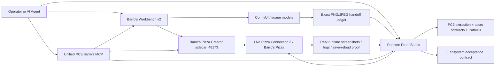
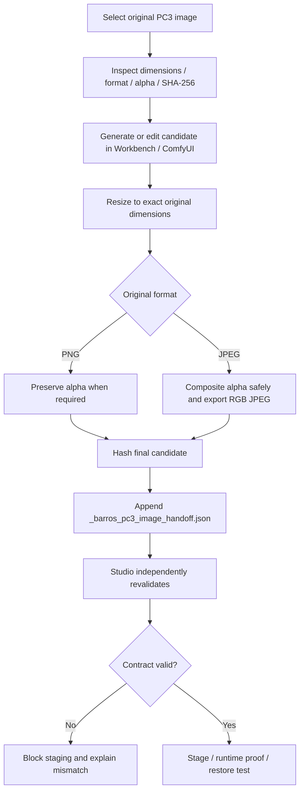
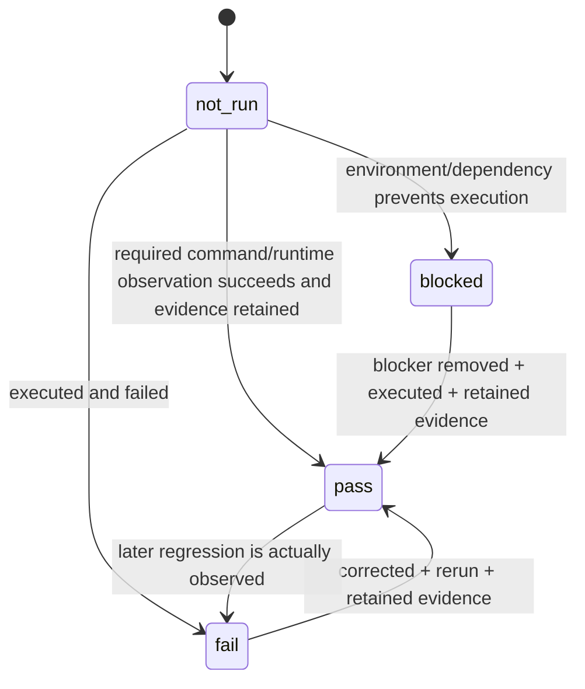

# Pizza Connection 3 / Barro's Pizza — Ecosystem v2 Architecture

This document is the recovery-oriented integration map for Barro's Pizza Creator, Barro's Workbench, and PC3 Barro's Runtime Proof Studio.

## Naming and compatibility rule

**User-facing game/project name:** `Pizza Connection 3 / Barro's Pizza`.

The original technical identity remains unchanged where the engine/toolchain requires it: `Pizza Connection 3.exe`, `Pizza Connection 3_Data`, `Assembly-CSharp.dll`, Unity `2017.4.40f1`, scene/object IDs, PathIDs, hashes, serialized field names, and original stock paths. Never rename those identifiers merely for branding.

## One ecosystem, three responsibilities

### Barro's Pizza Creator

Authoritative for live Pizza Creator recipe/game behavior:

- injected fifth Pizza Creator tab through BepInEx;
- real 87-item ingredient catalog supplied by the running game;
- native PizzaModel preview/apply/restore/save path;
- game-native scores after preview;
- Chat, AI Lab, Design Crew and Chef Voice;
- local sidecar on `127.0.0.1:48173`;
- provider routing and deterministic offline fallback;
- retained runtime evidence and F8 screenshots.

It does **not** become a general PC3 image editor. Workbench and Studio own that responsibility.

### Barro's Workbench v2

Authoritative for fast asset creation/orchestration:

- dual source/output visual file panels;
- ComfyUI img2img and batch generation;
- local/hosted LLM chat and MCP tool access;
- live Pizza Creator status/design tools;
- exact PNG/JPEG source-contract inspection;
- exact dimension/format/alpha export;
- SHA-256 Workbench→Studio handoff ledger.

### Runtime Proof Studio v1 integration

Authoritative for reverse engineering, mapping, staging and proof:

- PC3 install/build discovery;
- source extraction and Unity object/texture metadata;
- asset-family catalog and PathID truth;
- visual editors and scene placement recipes;
- stock/candidate comparison and validation;
- loose and packed staging/apply/restore workflows;
- runtime bridge and screenshot evidence;
- Creator acceptance/evidence workspace;
- Workbench image-handoff revalidation;
- unified MCP server for agents.

## PNG/JPEG generation contract

A pretty image is never enough. The exact original PC3 target is the contract.

## Agent access

The unified Studio MCP wrapper imports the existing Runtime Proof Studio MCP server and extends the same tool surface. Agents therefore get one coherent PC3/Barro's toolset rather than multiple competing servers.

New ecosystem operations include:

- `barros_ecosystem_status`
- `barros_pizza_creator_health`
- `barros_pizza_creator_design`
- `barros_creator_contract_status`
- `barros_creator_evidence_index`
- `validate_barros_workbench_handoff`
- `run_barros_creator_proof`
- `launch_barros_workbench`

Existing extraction, catalog, snapshot, compare, validation, staging, runtime, packed-patch, restore, image-contract, doctor and truth-contract tools remain available.

Read/status/validation operations are unguarded. Game/workspace mutations, desktop process starts and proof execution use explicit confirmation where appropriate.

## Creator HTTP boundary

The Creator sidecar remains intentionally small:

| Method | Endpoint | Responsibility |
|---|---|---|
| GET | `/health` | backend/provider status |
| GET | `/history` | retained Creator conversations/designs |
| POST | `/compose` / `/chat` | one recipe/design response |
| POST | `/lab` | three valid alternatives |
| POST | `/crew` | multi-agent design review |
| POST | `/transcribe` | speech-to-text path |
| POST | `/reload` | reload provider settings |
| POST | `/shutdown` | controlled sidecar stop |

Workbench/Studio do not clone the recipe solver. They call this boundary with the real catalog.

## Truth, proof and snapshots

Only `pass` is completion. Source presence, mockups, documentation, an unexecuted script, or a generated screenshot that is not from the running application/game is not runtime proof.

## Recovery after power loss or crash

The repositories are designed so work can resume from durable state rather than chat memory:

1. Git commits are the source-code checkpoint.
2. `contracts/ecosystem.acceptance.json` is the release truth contract.
3. `_barros_pc3_image_handoff.json` is the Workbench→Studio image ledger.
4. Studio `EVIDENCE/` contains hashes, comparisons, runtime captures and restore records.
5. Creator evidence contains proof-harness results and real F8 mode captures.
6. Studio truth contracts and change journal preserve asset versions/staging state.
7. No workflow should require rewriting the original `Assembly-CSharp.dll`.

After an interruption, first run the Workbench/Studio doctor or CI tests, refresh the ecosystem status, then continue only gates that are not already backed by retained evidence.

## Easy operator workflow

The intended normal workflow is deliberately short:

1. Start `START_PC3_BARROS_STUDIO.bat` or Workbench `run.bat`.
2. Choose an original PC3 target once.
3. Ask the assistant/agent to create or improve the Barro's replacement.
4. Workbench generates and automatically enforces the image contract.
5. Studio sees the handoff, validates it, and offers proof/staging actions.
6. Run the game proof; screenshots/logs attach to the evidence trail.
7. Restore stock automatically when testing requires rollback.

The operator should not have to manually calculate image dimensions, remember PathIDs, copy hashes, or interpret whether an unrun gate means success.

## Shared schema

All three repositories carry `contracts/pc3-image-handoff.schema.json`. Changes to that schema must be synchronized across Creator, Workbench and Studio before the ecosystem can pass its cross-project synchronization gate.
