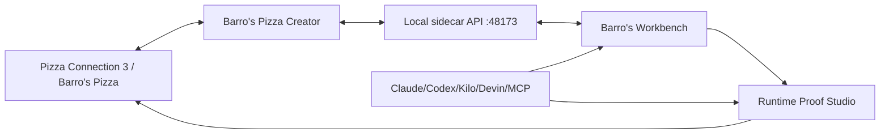

# Pizza Connection 3 / Barro's Pizza — Creator Integration Boundary

Barro's Pizza Creator is the in-game pizza-design authority inside the unified PC3 / Barro's toolchain.

## Authority rule

The Creator owns recipe/catalog repair and in-game pizza preview/apply/save behavior. Workbench and Studio consume its supported API, contracts and evidence; they must not create a divergent recipe engine or claim runtime proof from source presence alone.

## Image work

Pizza recipe attachments and asset-image generation are related but separate concerns. Workbench owns image generation/orchestration; Studio owns target validation/staging/runtime proof. The shared image acceptance contract is `contracts/ecosystem.image.acceptance.json`.

## Branding

User-facing project/game branding is **Pizza Connection 3 / Barro's Pizza**. Original PC3/Unity identifiers remain unchanged where compatibility, hashes, paths, assemblies, path IDs or reverse-engineering evidence require the original name.
