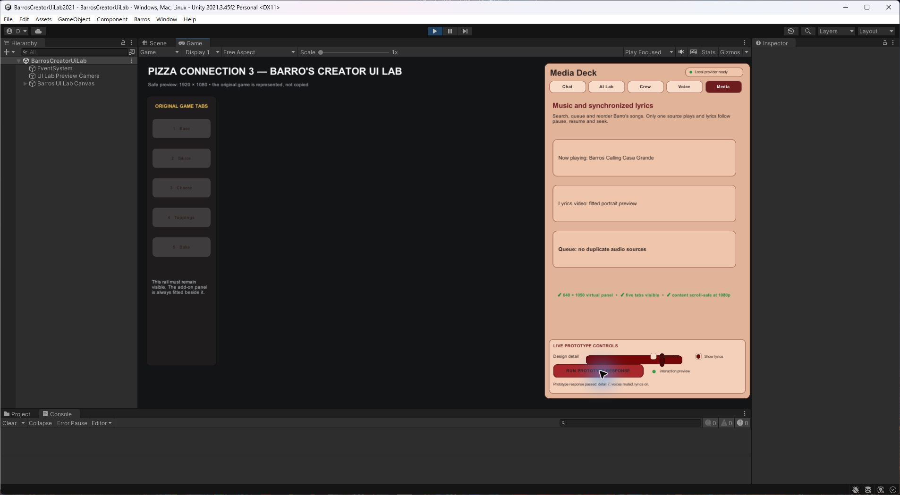
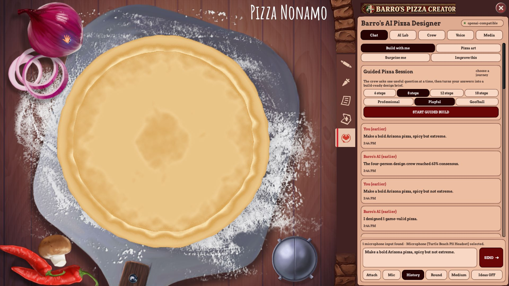

# Unity UI authoring and compatible-mod export pipeline

## What this solves

The Steam `Pizza Connection 3 - Pizza Creator` folder is a compiled Unity 2017.3.1p4 Windows game. It has no original `Assets`, `Packages`, `ProjectSettings`, editable scenes or source prefabs, so opening that folder in Unity Hub cannot recreate the game.

The repository therefore uses two clearly separated jobs:

1. **Unity 2021.3.45f2 authoring lab** — design and interactively preview new Barro's UI, 2D art and animation ideas.
2. **Unity 2017 runtime mod** — load compatible neutral exports through the existing BepInEx plug-in without rewriting the game.

## The beginner workflow

1. In Unity Hub choose **Open** and select `authoring/BarrosCreatorUiLab2021`.
2. Confirm Unity **2021.3.45f2**. Do not select either Steam game folder.
3. In Unity choose **Barros > 1 - Build or Refresh UI Prototype**.
4. Open `Assets/BarrosLab/Scenes/BarrosCreatorUiLab.unity` if it is not already open.
5. Select the **Game** view and press the Play triangle.
6. Click Chat, AI Lab, Crew, Voice and Media. Check that the dark original-game rail stays visible.
7. Choose **Barros > 2 - Export Unity 2017-Compatible UI Pack**.
8. Close Pizza Creator, run `INSTALL_Barros_AI_Designer.bat`, launch the game and press F10.

The user only needs to review the appearance. The repository tests, installer and runtime loader enforce the compatibility rules.

## Folder map

| Location | Purpose | Committed? |
|---|---|---|
| `authoring/BarrosCreatorUiLab2021/Assets/BarrosLab` | editable Unity lab source and proof scene | yes |
| `authoring/.../Library`, `Temp`, `Logs`, `UserSettings` | machine-specific Unity cache | no |
| `assets/ui/generated` | accepted PNG skins and JSON theme | yes |
| `BarrosAI/assets/ui/generated` under the game | isolated installed copy | no |
| `plugin-src/PanelRenderer.cs` | bounded runtime loader and fallbacks | yes |

## Compatible asset matrix

| New content | Author in | Export to mod | Runtime path |
|---|---|---|---|
| Rounded UI panels/buttons | Unity 2021 lab | PNG + JSON | direct validated texture load |
| Icons, portraits, pizza art | image editor/Unity 2021 | PNG/JPG | direct validated texture load |
| Simple 2D animation | Unity 2021 | PNG sprite sheet + reviewed JSON timings | bounded plug-in animator (connection pulse proven) |
| Music | source WAV/MP3/OGG | normalized OGG | Media Deck |
| Lyric video | source editor | H.264/AAC MP4 | Unity 2017 VideoPlayer |
| Timed audio lyrics | reviewed transcript | same-name UTF-8 `.lrc` | Media Deck active-line highlighter |
| 3D model/mesh | Blender/Unity 2021 | FBX/OBJ + PNG textures | exact-2017 bundle stage |
| Prefab/material/animation clip | exact Unity 2017.3.1p4 staging project | Windows AssetBundle | future guarded bundle loader |
| New behavior/code | normal source editor | compiled BepInEx DLL | existing plug-in |

## Why there are no Unity 2021 AssetBundles

AssetBundles serialize Unity types using the Editor version that built them. Unity supports many older bundles in newer Players, but does not support loading a bundle from a newer Editor into an older Player reliably. The target Player is Unity 2017.3.1p4, so a Unity 2021 bundle is rejected by design.

For future 3D work, Unity 2021 remains the pleasant authoring and preview environment. It exports neutral FBX/OBJ meshes and PNG textures. A separate, isolated Unity 2017.3.1p4 staging project imports only those neutral files, builds a Windows x64 AssetBundle, and records its hash. That second project must never point at the Steam folder.

## Current validation

- Unity batch marker: `BARROS_UI_LAB_OK ... size=1920x1080 tabs=5`.
- Export marker: `BARROS_UI_EXPORT_OK ... files=6 format=png+json`.
- Runtime marker: `ui.exported_theme_loaded ... target=Unity2017`.
- Animation marker: `ui.exported_animation_loaded ... frames=8;fps=8;target=Unity2017`.
- Live geometry: panel x=1346..1920, original tab right edge x=1340, gap=6.
- Automated suite: 116/116.
- Every exported PNG hash is checked against `barros-ui-theme.json`.
- Missing/invalid/oversized skins use safe built-in fallbacks; a missing pulse strip uses the static connection dot.

## Next authoring milestone

1. Create the isolated Unity 2017.3.1p4 AssetBundle staging project.
2. Export one harmless test mesh from Unity 2021, rebuild it in 2017, load it read-only, and retain the bundle/hash evidence.
3. Add an animation preview/control page to the authoring lab before expanding beyond the proven connection pulse.
4. Only after exact-2017 bundle proof, consider new 3D ingredient meshes or animated decorative elements.

