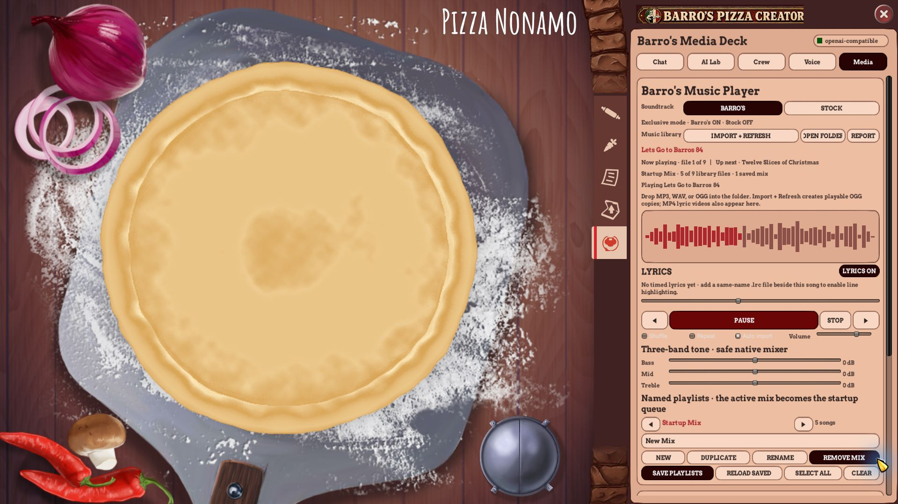
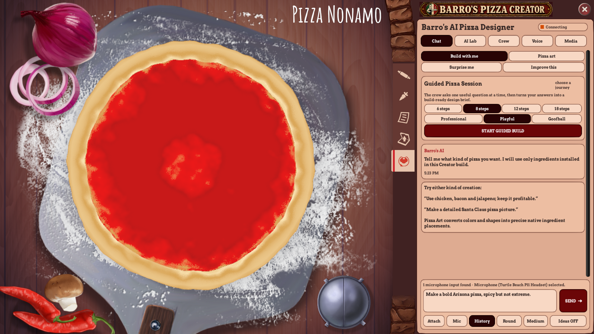

# Barro's Pizza Creator v1.6 runtime proof — 2026-08-27

## Release identity

| Item | Verified value |
|---|---|
| Game | Pizza Connection 3 - Pizza Creator 0.11.272 |
| Game Unity runtime | 2017.3.1p4 x64 |
| Authoring lab | Unity 2021.3.45f2 |
| Plug-in | Barro's AI Pizza Designer 1.6.0 |
| Plug-in bytes | 157,184 |
| Plug-in SHA-256 | `c052adc8ee12a5c3a5e1c36d67b0366d22e917ce744c1664c43684b42e7d54bb` |
| Automated tests | 121/121 passed |

## Unity authoring/export proof

Unity 2021.3.45f2 compiled `authoring/BarrosCreatorUiLab2021`, generated the `BarrosCreatorUiLab` scene, and emitted:

- `BARROS_UI_LAB_OK ... size=1920x1080 tabs=5`;
- `BARROS_UI_EXPORT_OK ... files=5 format=png+json`;
- `BARROS_UI_LAB_BATCH_OK`.

The Game view was inspected in Play mode. Chat opened alone, all five top tabs switched, the dark protected rail remained visible, and the prototype action changed the status to `Prototype response passed: detail 7, voices muted, lyrics on.`

## Exact-game UI and media proof

The normal Steam game loaded BepInEx 5.4.23.5 under Unity `v2017.3.1.8332599`, loaded Barro's Designer 1.6.0, started the local backend and injected the live Pizza Creator service/database bridge.

Retained runtime events:

- `ui.exported_theme_loaded format=png; source=BarrosCreatorUiLab2021; target=Unity2017`;
- `ui.panel_fitted left=1346.0; right=1920.0; width=574.0; tab_right=1340.0; gap=6.0`;
- `media.play title=Lets Go to Barros 84; type=.ogg`.

At 1920×1080 the live Chat and Media modes displayed all five mode tabs. The compact Media layout kept transport, lyric status, volume, three-band tone, playlist buttons and the vertical scroll area inside the panel. Barro's soundtrack was ON while Stock was OFF, so only one music source played.

## Final complete header proof

The final `1280×143` header asset SHA-256 is `9c33eaa474e9d53cd568e1f38432760f0b4ec178b5b7aa7cb21ebaba123d756f`. Unlike the earlier clipped artwork, it retains the chef medallion, exact `BARRO'S PIZZA CREATOR` wording and both decorative end caps. The runtime centers it within the usable title strip by reserving the native 78-pixel close-button area and shifts the banner center 39 pixels left. Its render height is increased by eight pixels for clearer 1080p presentation.

The retained 1920×1080 game screenshot shows the complete sign with safe clearance above all five tabs and before the close control. Screenshot SHA-256 is `6e46d6ceaeb3ed6df820f24e6317e3a93beec8410ab63fc6ba83810419b04ffb`.

## Lyric videos

All four owner-supplied videos passed a complete FFmpeg decode after conversion to the Unity-safe H.264/AAC profile:

| File | Bytes | SHA-256 |
|---|---:|---|
| `06 Red White and Barros - Lyrics Video.mp4` | 6,856,726 | `cd84b61ddbb7368515fcdf15bdd19410b5d8c22f9af06c6faa1d45d9b0feef52` |
| `07 The Apron on the Chair - Lyrics Video.mp4` | 11,788,621 | `69f230c037e3efb1d3d937e1a02391467ca4c7364d071ac466da2ae93136f936` |
| `08 Barros Calling Casa Grande - Lyrics Video.mp4` | 12,265,821 | `4cbf1a9e6dabedd874e657dee37fb72d32b47bba1ef28052be2345747daf6101` |
| `09 Red White and Barros Calling Mashup - Lyrics Video.mp4` | 9,133,135 | `cd5114e045730711e835e2e7c5000b94a4f6cc578bf418850620ca42ee460159` |

The high-profile Casa Grande video was exercised in the exact game: native Windows path preparation passed, portrait rendering fitted, pause retained its frame, resume continued, seek moved to a later verse, Lyrics Off hid the visual while audio continued, and Lyrics On restored it at the current time.

Audio-only same-name `.lrc` parsing/highlighting follows the actual player clock and therefore retains sync through pause/resume/seek. A local OCR draft was generated from the lyric video but rejected after review because it contained garbled lines. No inaccurate LRC is packaged.

## Provider, voice and microphone truth

- Direct MiniMax `/chat` and `/crew` requests passed against the configured model endpoint; one in-game crew request used the local fallback, so the UI run is not represented as an online-only pass.
- Azure synthetic TTS succeeded and its WAV was successfully transcribed by Azure STT.
- Four distinct agent voices played sequentially under one music-focus window; agents did not overlap and music resumed after the final voice.
- Windows detected `Microphone (Turtle Beach P11 Headset)` and capture opened. The retained physical-microphone attempt contained no recognized spoken phrase, so physical spoken transcription remains user-confirmation pending.

## Explicit remaining boundaries

- Native recipe Save/reload was not exercised because it writes shared user-profile data.
- No reviewed timed LRC transcript is packaged for the audio-only songs; lyric-video text is the verified lyrics path.
- Subjective loudspeaker smoothness and real spoken-mic recognition still require the user to listen/speak.
- The local Inspiration Library contains zero images.
- The Unity 2021 lab handles UI/neutral assets; exact Unity 2017 AssetBundle staging for new 3D prefabs is the next milestone, not part of v1.6.
- No unrelated PC2/PC3 repository was modified.
